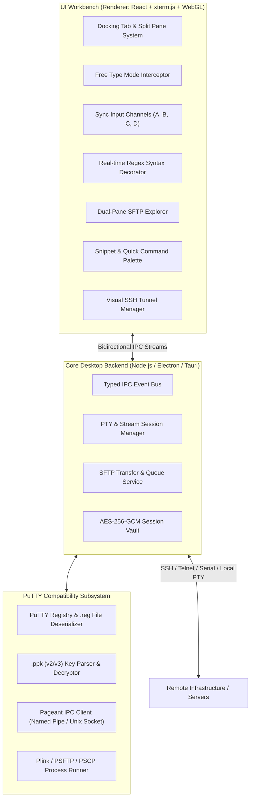

# Comprehensive Technical Proposal: WinPutty

> **Project Vision**: An open-source, modern, IDE-grade terminal emulator and session manager engineered as an advanced wrapper and successor to **PuTTY**, embedding the beloved capabilities of **WindTerm** (Free Type Mode, Sync Input, Integrated SFTP, Regex Markers) while providing 100% transparent open-source security.

---

## 1. Motivation & Opportunity

Modern operations engineers face a frustrating dichotomy:
* **The Legacy Trust Camp (PuTTY, KiTTY)**: Flawless security track record, ultra-fast, native `.ppk` and Pageant support. But the user interface is stuck in 1999—no native tabs, no split panes, no SFTP file explorer, no command broadcasting, and no modern text handling.
* **The Modern UX Camp (WindTerm, Termius, MobaXterm)**: Feature-rich and IDE-like, but marred by closed-source proprietary cores, vendor lock-in, commercial paywalls, or maintainer abandonment (as seen in WindTerm).

**WinPutty** bridges this divide by using **PuTTY** as its cryptographic and session bedrock while offering an open-source, modern desktop frontend delivering WindTerm's exact feature set.

```
       [ PuTTY Foundation ]                  [ WindTerm Innovation ]
   • MIT Licensed & Audited              • Free Type Mode (click-to-edit)
   • Windows Registry Sessions           • 4-Channel Sync Input Broadcast
   • Native .ppk (v2/v3) Keys            • Integrated Dual-Pane SFTP
   • Pageant SSH Agent IPC               • Regex Highlighters & Triggers
               \                                    /
                \                                  /
                 ▼                                ▼
            ═════════════════════════════════════════════
                       WinPutty (OpenWind)
            • 100% Genuine Open Source (MIT/Apache 2.0)
            • Cross-Platform (Win / Mac / Linux)
            • IDE-Grade Terminal Workbench
            ═════════════════════════════════════════════
```

---

## 2. System Architecture

WinPutty follows a high-performance modular architecture separating the **UI Terminal Workbench**, the **Core Runtime / PTY Manager**, and the **PuTTY Subsystem**:



---

## 3. Detailed Feature Specifications

### 3.1. PuTTY Ecosystem Native Bridge (Linux & Windows)
* **Linux PuTTY Native Storage (`~/.putty/sessions`)**:
  * On Linux systems, PuTTY stores sessions directly under `~/.putty/sessions/` in percent-encoded filenames (e.g. `10.10.10.10%20`, `COM%20USB0`).
  * WinPutty reads and parses these session files directly, giving Linux users instant zero-setup access to all their existing PuTTY profiles.
  * Writes and modifications sync back to `~/.putty/sessions/`, ensuring 100% interoperability with `/usr/bin/putty`.
* **Windows PuTTY Registry**:
  * On Windows, automatically reads and writes `HKCU\Software\SimonTatham\PuTTY\Sessions`.
* **Linux PuTTY Toolchain Integration**:
  * Native execution of `/usr/bin/plink`, `/usr/bin/psftp`, `/usr/bin/pscp`, and `/usr/bin/puttygen`.
  * Support for Linux hardware serial interfaces (`/dev/ttyUSB0`, `/dev/ttyACM0`).
* **PPK Key Engine**:
  * Native parsing of `.ppk` v2 (SHA-1) and `.ppk` v3 (Argon2id) keys without external dependencies.
  * In-memory key decryption with zero disk caching of unencrypted private keys.
* **Linux SSH Agent & Pageant IPC**:
  * On Linux, connects natively via Unix domain socket (`$SSH_AUTH_SOCK`) to Pageant or OpenSSH agent.
  * On Windows, connects via Named Pipe (`\\.\pipe\pageant.*`) or shared memory.

### 3.2. WindTerm "Free Type Mode" Engine
* **The Mechanism**:
  * In standard terminals, mouse clicks only trigger xterm mouse reporting or text selection.
  * When **Free Type Mode** is toggled (`Alt+Click` or toolbar toggle):
    1. The UI captures mouse click coordinates `(row, col)` within the terminal buffer.
    2. The engine detects the command prompt boundary via OSC 133 or heuristics.
    3. The engine computes the delta between the current cursor position and the click point.
    4. Emits the exact sequence of cursor movement escape sequences (`\x1b[C`, `\x1b[D`) or shell navigation keys (`Alt+F`, `Alt+B`, `Ctrl+A`) to position the shell cursor right under the mouse.
    5. Allows direct text replacement and drag-and-drop argument reordering directly on the terminal canvas.

### 3.3. WindTerm "Sync Input" Channels (Broadcast Channels)
* **The Mechanism**:
  * 4 discrete broadcast channels: **Channel A (Red)**, **Channel B (Blue)**, **Channel C (Green)**, **Channel D (Yellow)**.
  * Any open terminal tab can be assigned to one or more channels via a toolbar selector.
  * When typing into an active tab with Channel A active:
    * Keystrokes are captured before PTY transmission.
    * A broadcast router mirrors the keystrokes simultaneously to all session PTYs assigned to Channel A.
    * Latency and execution status are tracked per session.
    * A persistent warning banner ensures users know when Sync Input is engaged to prevent unintended cluster commands.

### 3.4. Integrated Dual-Pane SFTP with Directory Following
* **The Mechanism**:
  * Dockable side or bottom panel displaying:
    * Left pane: Local filesystem.
    * Right pane: Remote filesystem via SFTP.
  * **OSC 7 / Shell Directory Following**: When the terminal executes `cd /var/log`, an OSC 7 escape sequence or prompt hook notifies the SFTP client, which automatically navigates the remote pane to `/var/log`.
  * **Drag and Drop**: Dropping files from desktop or local explorer into the SFTP pane or directly into the terminal window initiates background chunked SFTP upload.
  * **Transfer Queue**: Concurrent transfer manager with pause, resume, progress percentage, and transfer speed telemetry.

### 3.5. Real-Time Regex Syntax Highlighters & Triggers
* **The Mechanism**:
  * Custom `xterm.js` decoration provider scanning incoming screen buffer lines against compiled regex rules:
    * **Network**: IPv4 (`\b(?:\d{1,3}\.){3}\d{1,3}\b`), IPv6, MAC addresses.
    * **URLs & Endpoints**: `https?://[^\s/$.?#].[^\s]*`.
    * **Log Levels**: `ERROR|FATAL|CRITICAL` (bold red), `WARN|WARNING` (amber), `SUCCESS|OK|200` (green).
    * **Timestamps & UUIDs**: ISO-8601, RFC-2822, GUIDs.
  * **Expect-Style Automated Triggers**:
    * Configure rules such as: *When output matches `Password for .*: `, automatically send stored credential or prompt user.*

### 3.6. Visual SSH Tunneling & Port Forwarding
* Visual GUI for creating and inspecting tunnels:
  * **Local Port Forwarding (`-L`)**: Forward local port `8080` to remote `db.internal:5432`.
  * **Remote Port Forwarding (`-R`)**: Expose local port `3000` on remote server port `9000`.
  * **Dynamic SOCKS5 Proxy (`-D`)**: Open local SOCKS5 proxy on port `1080` routing traffic through the SSH bastion.
* Real-time traffic indicators: Active connections, bytes sent/received, error state.

### 3.7. Snippet & Quick Command Bar
* Dockable button ribbon with user-defined macros and scripts.
* **Variable Interpolation**:
  ```bash
  journalctl -u {{service_name}} -n {{lines=100}} --no-pager
  ```
  * Clicking the button opens a quick modal with parameter defaults, then feeds the interpolated string into the terminal buffer.

---

## 4. Security & Trust Architecture

Unlike WindTerm's controversial closed-source core:
1. **Zero Proprietary Binary Blobs**: The entire codebase is 100% open-source TypeScript, Rust/C++, and HTML/CSS. Anyone can inspect, build, and verify reproducible binaries.
2. **Master Key AES-GCM Vault**: Saved credentials and passwords are encrypted using **AES-256-GCM** derived with **PBKDF2** (or Argon2id) from a user-supplied master password.
3. **Agent Isolation**: When using PuTTY's Pageant or system SSH agents, private keys never enter WinPutty's memory space—cryptographic signing is performed securely inside Pageant.

---

## 5. Technology Stack Recommendation

| Component | Selected Technology | Rationale |
| :--- | :--- | :--- |
| **App Framework** | Electron or Tauri (Rust) | Cross-platform, rich window management, high-performance native bridges. |
| **Terminal Core** | `xterm.js` + WebGL Addon | Industry standard (used in VS Code), capable of 60 FPS rendering, full buffer access for Free Type Mode and regex markers. |
| **PuTTY Subsystem** | Custom TypeScript / C++ Native Addon | High-speed parsing of PuTTY registry, PPK files, and Pageant Windows named pipe IPC. |
| **SSH & SFTP Engine** | Dual: `plink.exe` wrapper + `ssh2` | Offers flexibility between genuine PuTTY execution and pure in-process SSH2 streams. |
| **UI Framework** | React + Tailwind CSS + Lucide Icons | Clean, responsive, dark-mode native IDE layout with dockable panels. |

---

## 6. Implementation Phasing

* **Phase 1: Research & Documentation (Current)**: Forensic analysis of WindTerm, PuTTY interface specifications, and architectural documentation.
* **Phase 2: PuTTY Bridge & Key Engine**: Registry reader, `.ppk` parser, and Pageant IPC integration.
* **Phase 3: Terminal Core & Free Type Mode**: Tabbed terminal workspace with xterm.js and mouse-driven Free Type Mode.
* **Phase 4: Multi-Session Sync Input & Regex Markers**: 4-channel broadcast system and real-time regex highlighting.
* **Phase 5: SFTP Explorer & Port Forwarding**: Dual-pane file manager, transfer queue, and visual tunnel configuration.
